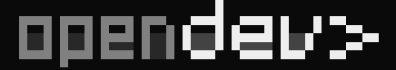

<p align="center">
  
</p>
<p align="center">OpenDev — une variante de l'agent de codage IA open source.</p>

---

> [!IMPORTANT]
> OpenDev n'est **pas** développé par l'équipe OpenCode et n'est **pas** affilié à celle-ci d'aucune manière.
> Ce projet est une variante de [OpenCode](https://github.com/anomalyco/opencode) par
> [anomalyco](https://github.com/anomalyco), l'agent de codage IA open source original.
> Tout le crédit pour la base de code upstream revient aux auteurs et contributeurs d'OpenCode.

---

### Qu'est-ce qu'OpenDev ?

OpenDev est une variante personnelle d'OpenCode, un agent de codage IA open source qui s'exécute dans votre
terminal. Il s'appuie sur la base de code d'OpenCode avec des modifications locales et une configuration adaptée
à ma façon de travailler.

Pour l'ensemble complet des fonctionnalités upstream, la documentation et la communauté, consultez
[**OpenCode**](https://github.com/anomalyco/opencode) et sa doc sur [**opencode.ai**](https://opencode.ai/docs).

### Installation

OpenDev s'exécute depuis les sources avec [Bun](https://bun.sh).

```bash
# Installer les dépendances
bun install

# Lancer le serveur de dev
bun dev

#si vous voulez, vous pouvez aussi le build

bun build ./src/index.ts --compile --outfile ./dist/OpenDev.exe
```

Pour les installations binaires upstream (OpenCode non modifié), voir le
[installateur officiel](https://opencode.ai/install).

### Documentation

OpenDev se configure de la même manière qu'OpenCode. Pour savoir comment OpenCode est configuré, rendez-vous sur la doc upstream à
[**opencode.ai/docs**](https://opencode.ai/docs).

### Contribuer

Ceci est un projet personnel, mais les contributions sont bienvenues

---

**Crédits :** Construit sur [OpenCode](https://github.com/anomalyco/opencode) par [anomalyco](https://github.com/anomalyco).